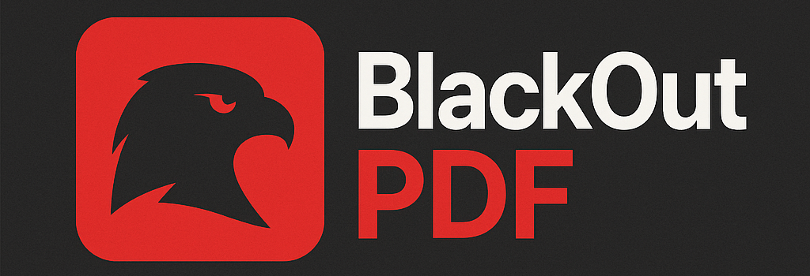

# BlackOutPDF


BlackOutPDF is a Python desktop application built with PyQt5 that allows users to load PDF files, blackout sensitive areas, apply OCR, and export secured PDFs with optional password protection.

---

## Features

- Load and display PDF pages as images
- Draw blackout rectangles to censor sensitive content (redaction)
- Highlight areas with yellow marker
- Insert signatures and stamps (from image files)
- Add text boxes anywhere on the document
- Add comment annotations
- Zoom in/out on pages
- Undo last action (blackout, highlight, annotation, etc.)
- OCR support to automatically detect and blackout text areas
- Dark/Light theme toggle
- Export blacked-out PDF with optional password protection
(all redacted areas are truly deleted from the PDF)
- Multi-page PDF support


---

## Requirements

- Python 3.7+
- PyQt6
- PyMuPDF (fitz)
- Pillow
- pytesseract
- Tesseract OCR engine installed on your system

---

## Installation

1. **Clone the repository**

```
git clone https://github.com/VIP33R/BlackOutPDF.git
cd BlackOutPDF
```

2. **Create and activate a virtual environment (recommended)**
```
python3 -m venv venv
source venv/bin/activate
```

3. **Install Python dependencies**
```pip install -r requirements.txt```

4. **Make sure you have LibreOffice and Tesseract OCR installed on your system**
*On Ubuntu/Debian*
```
sudo apt update
sudo apt install libreoffice tesseract-ocr
```

5. **Usage**
Run the application:
```
python BOPDF.py
```

## Building a standalone executable with PyInstaller

1. **Ensure your virtual environment is activated and you are in the project folder.**

2. **Build the spec file.**
```
   pyinstaller  .\BOPDF.py 
```

4. **Build the executable with icon (adjust the icon path accordingly):**
```
   pyinstaller --noconsole --onefile --icon=BOPDF.ico BOPDF.py
```

4. **After the build completes, the standalone executable will be in the dist/ folder:**
   ```dist/BOPDF```

5. **You can run the executable directly:**
```./dist/BOPDF```


## NOTES

To protect the exported PDF with a password, you will be prompted during export.
You can switch between light and dark themes from the UI.
The OCR feature helps you automatically detect text blocks to blackout.
Conversion to Word requires LibreOffice or a compatible suite installed on your system.


